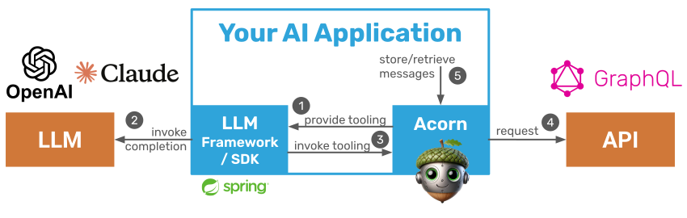

# Acorn-Java: LLM Tooling from GraphQL APIs

Acorn is a lightweight library that analyzes GraphQL APIs/queries and creates LLM tools from the available endpoints. Use Acorn to enable chatbots, agents, and other LLM applications to call GraphQL APIs for data retrieval and persistence.

Acorn provides the following features:

- Converts GraphQL Schemas (introspected or provided) to LLM tools (i.e. tooling definitions in JSON schema) that are supported by all popular LLMs (OpenAI, Anthropic, Google, Llama, etc.)
- Direct integration with LLM SDKs and agentic frameworks (e.g. Spring AI)
- Manages tool calling, schema validation, and data fetching
- Supports chat history persistence and retrieval through GraphQL API for Chatbots
- Extensible and modular to adjust it to your needs (e.g. bring your own query executor)
- Sandboxing for sensitive information (e.g. secrets, session ids) that cannot be passed to LLMs"

In short, Acorn eliminates boilerplate code when building chatbots and agents that interact with APIs. It integrates GraphQL APIs with LLMs in a small library that you can extend to suit your needs.



## Getting Started

### Spring Boot

To build an AI agent as a web application with Spring Boot, include the following dependency in your project and use the generic implementation in [SpringAITestApplication](acorn-springai/src/main/java/com/datasqrl/ai/spring/SpringAITestApplication.java) as a starting point for your own.

#### Gradle

```text
dependencies {
    implementation 'com.datasqrl:acorn-springai:0.1.0'
}
```

#### Maven

```text
    <dependency>
        <groupId>com.datasqrl</groupId>
        <artifactId>acorn-springai</artifactId>
        <version>0.1.0</version>
    </dependency>
```

### Generic

If you prefer a different web development framework or want to use Acorn Agent in a different context (e.g. a command line application), use the following dependency and take a look at the [command line agent implementation examples](acorn-starter/src/test/java/com/datasqrl/ai/example) for inspiration.

#### Gradle

```text
dependencies {
    implementation 'com.datasqrl:acorn-graphql:0.1.0'
}
```

#### Maven

```text
    <dependency>
        <groupId>com.datasqrl</groupId>
        <artifactId>acorn-graphql</artifactId>
        <version>0.1.0</version>
    </dependency>
```

## Documentation

The base implementation of Acorn can be found in the [acorn-graphql](acorn-graphql) module. See the [documentation](acorn-graphql/README.md) of that module for more information.

The [acorn-springai](acorn-springai) module integrates Acorn with Spring AI. See the [documentation](acorn-springai/README.md) of that module for more information.

## Contributing

We love contributions. Open an issue if you encounter a bug or have a feature request. See [CONTRIBUTING.md](./CONTRIBUTING.md) for more details.
